# BÁO CÁO: ỨNG DỤNG NHẬN NUÔI THÚ CƯNG

## 1. Giới thiệu
Hiện nay, nhu cầu nhận nuôi thú cưng đang ngày càng tăng cao, đặc biệt trong giới trẻ và những người yêu động vật. Tuy nhiên, quá trình tìm kiếm, lựa chọn và tiếp cận nguồn thú cưng cần nhận nuôi vẫn còn gặp nhiều khó khăn, thiếu thông tin, và chưa có nền tảng kết nối hiệu quả. Ứng dụng **“PetAdopt”** được xây dựng nhằm giải quyết bài toán trên bằng cách kết nối những người cần cho – nhận thú cưng trên nền tảng di động.

## 2. Mục tiêu của ứng dụng
- Hỗ trợ người dùng dễ dàng tìm kiếm, đăng ký nhận nuôi thú cưng.
- Tạo môi trường kết nối giữa những người cho – nhận thú cưng một cách minh bạch, tiện lợi.
- Cung cấp thông tin chăm sóc, tư vấn y tế.

## 3. Tính năng chính

### 3.1. Đăng nhập/Đăng ký tài khoản
- Hỗ trợ xác thực qua email, Google, hoặc mạng xã hội.
- Lưu thông tin người dùng, vai trò (người cho, người nhận).

### 3.2. Đăng tin cho thú cưng cần nhận nuôi
- Cho phép người dùng đăng tải thông tin thú cưng: hình ảnh, mô tả, thông tin về vật nuôi.

### 3.3. Liên hệ và nhắn tin
- Tính năng chat giữa người nhận và người cho thú cưng.

### 3.4. Tư vấn chăm sóc
- Cung cấp kiến thức chăm sóc, huấn luyện thú cưng.
- - Tích hợp hỗ trợ phản hồi tự động từ chatbot với vai trò **"Bác sĩ thú y"** để giải đáp thắc mắc.

## 4. Công nghệ sử dụng
- **Frontend:** React Native (JavaScript)
- **Backend:** Firebase (Firestore, Storage), Clerk (Authentication)
- **Expo Go**

## 5. Giao diện người dùng
- Giao diện thân thiện, dễ sử dụng với màu sắc tươi sáng, hình ảnh dễ thương.
- Thiết kế tối ưu cho thiết bị di động.

### Đăng nhập

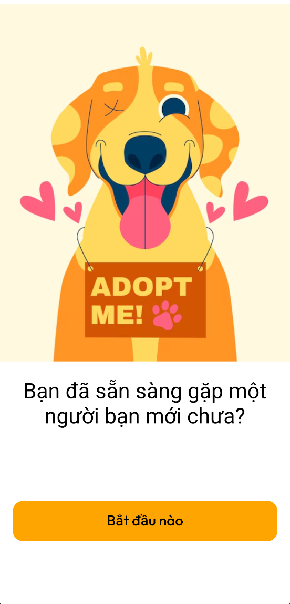
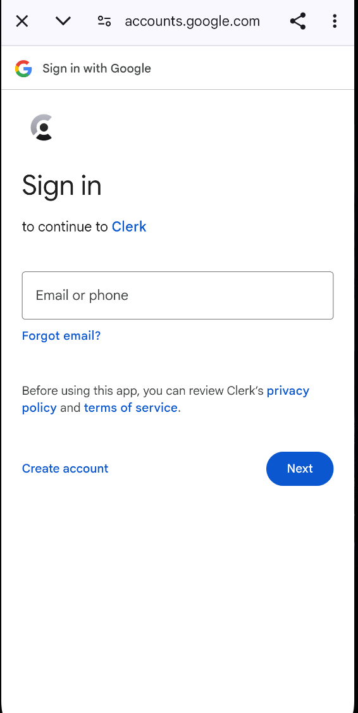

- Bạn có thể chọn tài khoản Google ngay trên thiết bị của bạn:
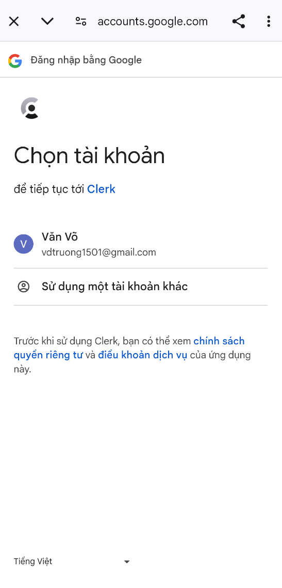

### Tabs (Home, Favorite, AI, Inbox, Profile)
<figure style="display:inline-block; text-align:center; margin-right:20px;">
  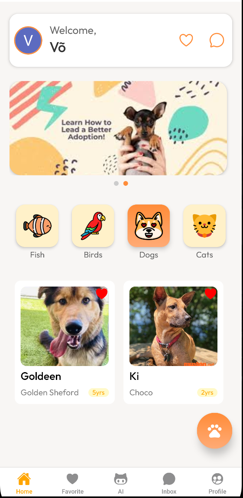
  <figcaption>Home</figcaption>
</figure>
<figure style="display:inline-block; text-align:center; margin-right:20px;">
  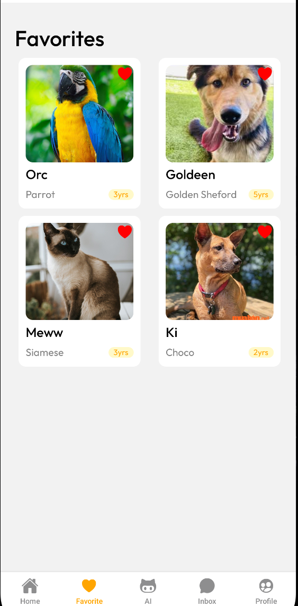
  <figcaption>Favorite</figcaption>
</figure>
<figure style="display:inline-block; text-align:center; margin-right:20px;">
  
  <figcaption>AI</figcaption>
</figure>
<figure style="display:inline-block; text-align:center; margin-right:20px;">
  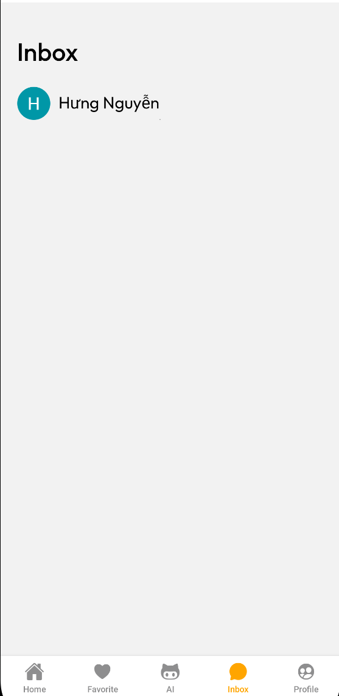
  <figcaption>Inbox</figcaption>
</figure>
<figure style="display:inline-block; text-align:center; margin-right:20px;">
  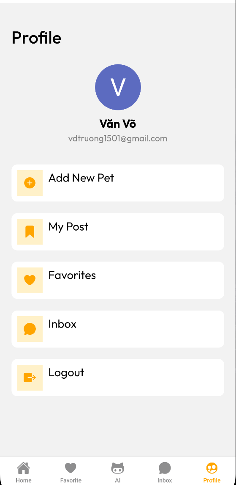
  <figcaption>Profile</figcaption>
</figure>

### Thông tin chi tiết về thú cưng

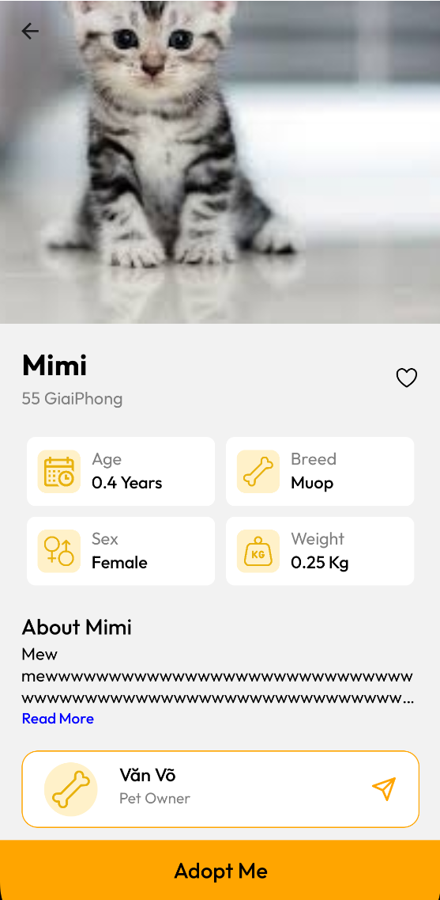

### Thêm thú cưng

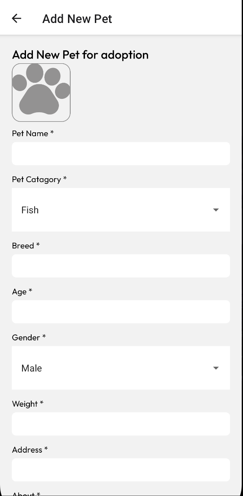
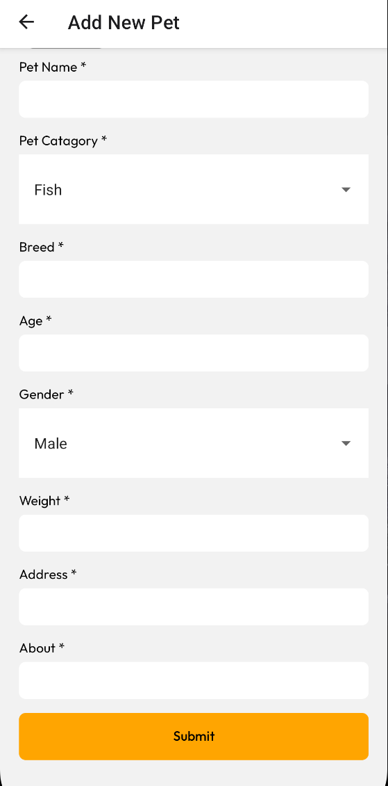

### Quản lý bài đăng
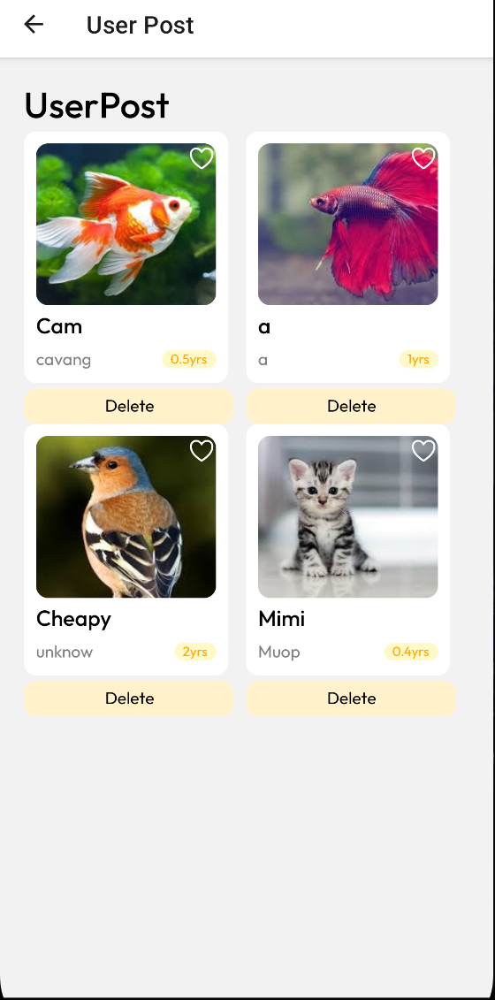

## 6. Đánh giá và hướng phát triển

### Ưu điểm:
- Giao diện đẹp, dễ sử dụng.
- Kết nối cộng đồng yêu thú cưng nhanh chóng.
- Có tích hợp AI để hỗ trợ người dùng trong việc chăm sóc thú cưng.

### Hạn chế:
- Cần xác minh người dùng kỹ hơn để tránh tình trạng lừa đảo.
- Cần phát triển thêm hệ thống đánh giá, phản hồi sau nhận nuôi.

### Hướng phát triển:
- Thêm tính năng định vị thú cưng bị lạc.
- Tích hợp hệ thống tiêm chủng và hồ sơ y tế điện tử.
- Hợp tác với các trạm cứu hộ và phòng khám thú y.

## 7. Kết luận
Ứng dụng **“PetAdopt”** không chỉ là cầu nối giữa người cho và người nhận nuôi thú cưng mà còn góp phần lan tỏa thông điệp nhân văn, khuyến khích yêu thương động vật và nâng cao ý thức chăm sóc thú cưng trong cộng đồng. Đây là một bước tiến mới trong việc áp dụng công nghệ để phục vụ mục tiêu xã hội.

---------------------------

# Test case